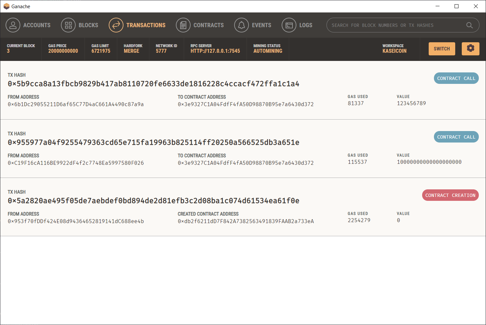
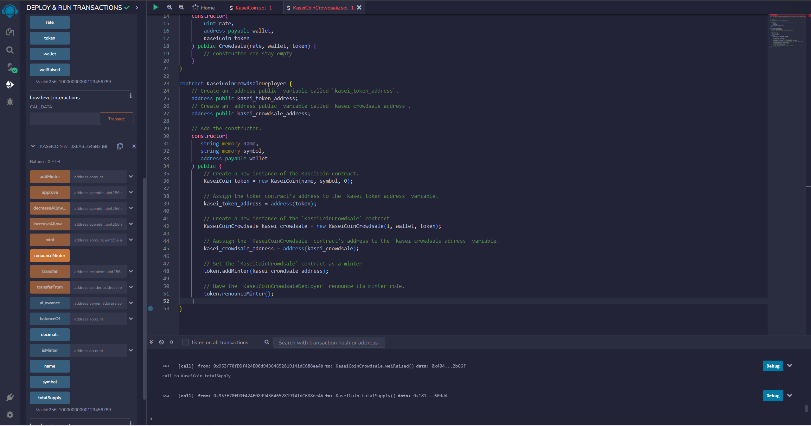

# Smart Contracts: Money on Mars
The aim of this project is to build a monetary system for the first human colony on Mars.

## About
Smart Contracts on the Ethereum network can be used to create cryptocurrencies following the ERC-20 standard. In this project an ERC-20 compliant fungible token called KaseiCoin will be created on the Ethereum network. This token will be used to conduct monetary transactions by the first Human colony on Mars. The goal is to launch a crowdsale for the KaseiCoin token so that those who are moving to Mars can convert their earth money to it.

## Getting Started
To run the application, you need to use an Ethereum IDE such as [Remix](https://remix.ethereum.org/).

To deploy the contracts on a local blockchain, you will also need a local Ethereum blockchain such as [Ganache](https://trufflesuite.com/ganache/) and a wallet such as [Metamask](https://metamask.io/).

## Usage

You can clone or download this GitHub project and open the `KaseiCoin.sol` and `KaseiCoinCrowdsale.sol` using any IDE of your choice, one being Remix.

Ensure that the compiler is using solidity version 0.5.5.

Deploy the `KaseiCoinCrowdsaleDeployer` contract using your wallet as the Injected Provider.

Call the contract addresses of the `KaseiCoin` and `KaseiCoinCrowdsale` in the deployed `KaseiCoinCrowdsaleDeployer` contract.

Select the corresponding contract in the "CONTRACT" drop box and use the "At Address" button to load the `KaseiCoin` and `KaseiCoinCrowdsale` contracts.

# Report
## KaseiCoin Contract

Create and compile the `KaseiCoin` token contract.

    

## KaseiCoin Crowdsale Contract

Create and compile the `KaseiCoinCrowdsale` contract.

    

## KaseiCoin Deployer Contract

Create and compile the `KaseiCoinCrowdsaleDeployer` contract.

    

## Deploy and Test the Crowdsale on a Local Blockchain

### KaseiCoin Crowdsale Deployer

Deploy the `KaseiCoinCrowdsaleDeployer` contract.

    

View the results on the local blockchain.

| |
|:--:|
|*Contract owned and deployed by Account 1*|

| | |
|:--:|:--:|
|*Block 1 created*|*Details of Block 1*|

| | |
|:--:|:--:|
|*Contract Creation transaction created*|*Details of the Contract Creation transaction*|

### KaseiCoin and KaseiCoin Crowdsale

Load the `KaseiCoin` and `KaseiCoinCrowdsale` contracts.

    

### Buying Tokens on Account 2

Purchase 10 ETH worth of KaseiCoin tokens using Account 2.

| |
|:--:|
|*Sign and Confirm the transaction on Account 2 using Metamask*|

View the results on the local blockchain.

| |
|:--:|
|*Crowdsale contract called by Account 2*|

| | |
|:--:|:--:|
|*Block 2 created*|*Details of Block 2*|

| | |
|:--:|:--:|
|*Contract Call transaction created*|*Details of the Contract Call transaction*|

Check the balance of Account 2 using the KaseiCoin contract "balanceOf" call.

| |
|:--:|
|*KaseiCoin balance of Account 2*|

### Buying Tokens on Account 3

Purchase 123456789 Wei worth of KaseiCoin tokens using Account 3.

| |
|:--:|
|*Sign and Confirm the transaction on Account 3 using Metamask*|

View the results on the local blockchain.

| |
|:--:|
|*Crowdsale contract called by Account 3*|

| | |
|:--:|:--:|
|*Block 3 created*|*Details of Block 3*|

| | |
|:--:|:--:|
|*Contract Call transaction created*|*Details of the Contract Call transaction*|

Check the balance of Account 3 using the KaseiCoin contract "balanceOf" call.

| |
|:--:|
|*KaseiCoin balance of Account 3*|

### Token Balances on Metamask

Check the KaseiCoin token balances of Account 2 and Account 3 on Metamask.

| |
|:--:|
|*Import the KaseiCoin token using the token's address*|

| | |
|:--:|:--:|
|*Token balances of Account 2*|*Token balances of Account 3*|

### Total Minted Token Supply and Wei Raised by the Crowdsale

Review the total supply of the minted KaseiCoin tokens and the amount of wei the KaseiCoin crowdsale contract has raised by using the "weiRaised" and "totalSupply" calls on the `KaseiCoinCrowdsale` and `KaseiCoin` contracts respectively.

    

## Contributor
Andy Vu